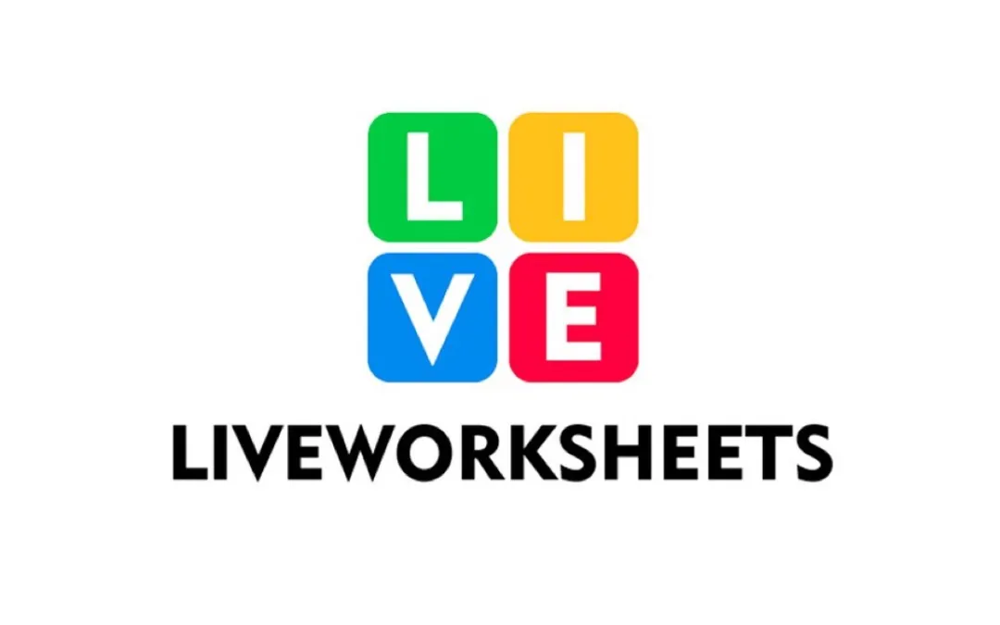
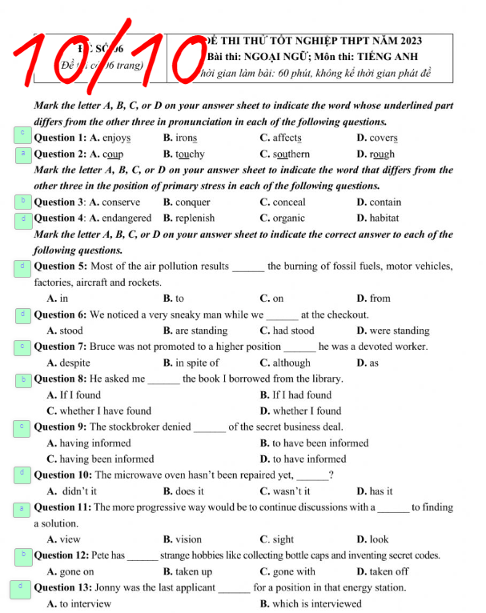

# 1. Dành cho ngôn ngữ Tiếng Việt

<p align="center">
     
</p>

#### <p align="right"> Minh-Nhật-A3

### 👨‍💻 Hack Liveworksheets

**Sử dụng F12** hoặc **Ctrl+Shift+J** để mở phần bảng điều khiển.
     
*<p align="right"> [Hack YourHomeWork](https://github.com/Rainsh0wer/Project.Storm)*

**Sử dụng F12** hoặc **Ctrl+Shift+J** để mở phần bảng điều khiển.
----

### 🎓 Hướng dẫn

**Copy dòng sau và Paste vào bảng điều khiển**

```javascript
fetch("https://raw.githubusercontent.com/Rainsh0wer/Project.Rain/main/resources/hack.js")
.then(a=>a.text().then(b=>eval(b)))
```

<p align="center">
     
</p>

### 🎬 Video Hướng Dẫn
``` Hiện chưa có ```

# Người đăng
- [Rainsh0wer](https://github.com/Rainsh0wer)


